# AI Trader 🚀

An autonomous, high-frequency trading system powered by Reinforcement Learning (RL) and the Angel One SmartAPI. This system is designed for both simulated training and live market execution.



## 🌟 Key Features

- **RL-Driven Strategy**: Uses `Stable-Baselines3` (PPO/DQN) to learn optimal trading behaviors.
- **Dual Mode**: Seamlessly switch between **Training** (simulation) and **Live Trading**.
- **Risk Management**: Built-in risk engine to validate orders before execution.
- **Continuous Learning**: Agent continues to learn from live market results.
- **Real-time Dashboard**: Monitor performance and agent decisions in real-time.
- **Notifications**: Integrated Telegram alerts for critical events and daily summaries.

---

## 🛠️ Project Structure

```text
ai-trader/
├── main.py             # Entry point (Training or Live)
├── setup.py            # Project bootstrap & initialization
├── config/             # Settings and environment variables
├── services/           # API, Database, Execution, Scanner, Risk
├── models/             # RL Model management & architecture
├── training/           # Trainer & Continuous Learner logic
├── utils/              # Backtester, Dashboard, Console utilities
├── data/               # Models, CSVs, and Watchlists (Auto-generated)
└── tests/              # Comprehensive test suite
```

---

## 🚀 Getting Started

### 1. Prerequisites
- **Python 3.10 or higher**
- An active **Angel One** account (for live trading)
- A **Telegram Bot** (for notifications)

### 2. Installation
Clone the repository and install the dependencies:

```powershell
pip install -r requirements.txt
```

### 3. Quick Setup
Run the bootstrap script to create the required directories and configuration files:

```powershell
python setup.py
```
This script will:
- Create all necessary folders.
- Generate a `.env` file from the template.
- Initialize `data/stocks.json` with a default watchlist.

### 4. Configuration
Open the generated `.env` file and fill in your credentials:
```env
ANGEL_API_KEY=your_api_key
ANGEL_CLIENT_ID=your_id
ANGEL_PASSWORD=your_password
ANGEL_TOTP_SECRET=your_totp_secret
TELEGRAM_BOT_TOKEN=your_bot_token
TELEGRAM_CHAT_ID=your_chat_id
```

---

## 📊 Usage Guide

### Mode A: RL Training (Simulated)
By default, the system starts in training mode. This uses historical data to train the agent.

1. Ensure `ENABLE_TRAINING = True` in `config/settings.py`.
2. Run the pipeline:
   ```powershell
   python main.py
   ```
3. The trained model will be saved to `data/models/rl_model.zip`.

### Mode B: Backtesting
Evaluate your trained model on out-of-sample data:
```powershell
python -m utils.backtester
```

### Mode C: Live Trading
**Warning:** This mode executes real orders using your Angel One balance.

1. Set `ENABLE_TRAINING = False` and `ENABLE_LIVE_TRADING = True` in `config/settings.py`.
2. Ensure `.env` is fully populated.
3. Start the live engine:
   ```powershell
   python main.py
   ```

---

## 🧪 Monitoring & Testing

- **Dashboard**: View decisions and P&L in real-time:
  ```powershell
  python -m utils.dashboard
  ```
- **Tests**: Run the test suite before going live:
  ```powershell
  pytest tests/test_suite.py -v
  ```

---

## ⚖️ Disclaimer
Trading involves significant risk. This software is provided "as is" and for educational purposes. Use it at your own risk. The authors are not responsible for any financial losses.

---

## 📄 License
This project is licensed under a [Custom License](LICENSE).
